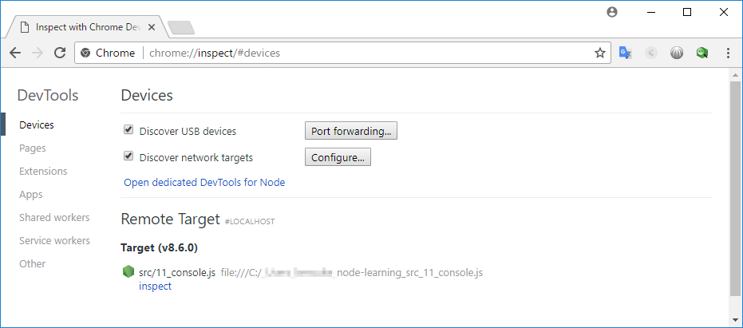
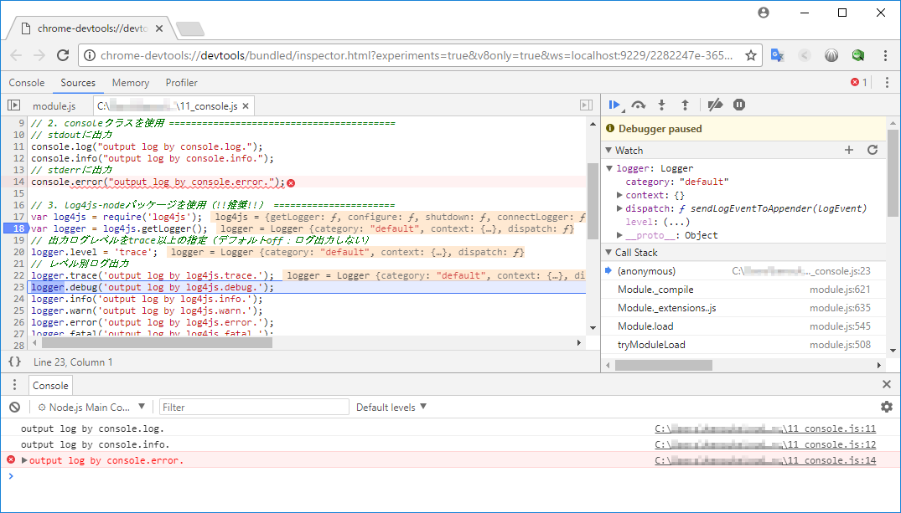

デバッグ方法
====

Node.jsのプログラムを実行しながらデバッグする。

CUIでのデバッグ(built-in debugger)
----

メリット
： node単体で実施できるため、GUIがない環境でも使用できる

デメリット
： めんどくさー

### 実行方法

    node inspect src/11_console.js

実行例
: [12_eg_cui_debugging.txt](12_eg_cui_debugging.txt)

詳細説明
: [https://nodejs.org/api/debugger.html](https://nodejs.org/api/debugger.html)

|コマンド|内容|
|---|---|
|.exit|デバッグ中止|
|run|最初から再実行|
|cont|現在行以降を連続実行|
|n|ステップ実行|
|watch('xxx')|xxxの内容を出力(ウォッチ設定)|
|unwatch('xxx')|xxxの内容出力を取り消す(ウォッチ削除)|
|sb(line)|ブレークポイントを設定|
|cb(line)|ブレークポイントを削除|

GUIでのデバッグ(Google Chrome 使用)
----

Node.jsはV8エンジンを使用したホスト動作のjavascriptのため、Chromeと親和性が高い。Atom等でデバッグすることもできるが、機能面でChromeが優勢。

### 実行方法

* 通常実行

        node --inspect src/11_console.js

* プログラム開始時ブレーク(PORT指定)

    ~~~
    $ node --inspect-brk=9229 src/11_console.js
    Debugger listening on ws://127.0.0.1:9229/6d7dfa48-9395-4ad3-8074-0992cb05764f
    For help see https://nodejs.org/en/docs/inspector
    ~~~

    Chromeで`chrome://inspect`にアクセス。

    

    `Remote Target`からアタッチしたいターゲットの「inspect」をクリックしてデバッグを開始する。

    

> Chromeの拡張機能に NIM (Node.js Inspector Manager)を入れておくと、ポートを監視してくれて自動的にデバッガーが表示されるので便利。(Linux版Chromeだとうまくいかないことあり。)
